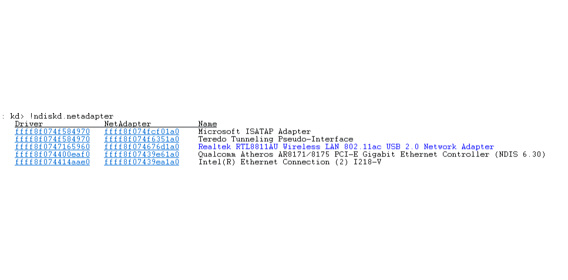

You already know that I'm a fan of the [Easter Eggs](http://mrbit.me/WinDBG-Easter-Eggs/) in the !ndiskd WinDbg extension, but let's talk business.

`!ndiskd.miniports` will spit out some [info about the miniports present on the system](https://msdn.microsoft.com/en-us/library/windows/hardware/ff564148(v=vs.85).aspx).

Sometimes, the miniport's name will be in some crazy color. Sometimes the system will have miniports with multiple colors. It's sort of like Fiji water bottles - it's pretty, but nobody's entirely sure what the point of it is.

(as far as I know `!ndiskd.netadapter` and `!ndiskd.miniports` are functionally the same. Don't quote me on that, though - !ndiskd is desparately in need of a documentation update. Do you know? Drop me a line.)

The maddening part - it's not documented anywhere! What the heck is that blue for? Well, I needed answers, so I asked the NDIS team themselves.

Here's what they told me: 

- Blue: There's an ongoing binding change on the miniport.
- Red: The miniport is halted. However, more commonly seen when the miniport is on the miniport removal path, but not completely removed yet.
- Green: Miniport is powered down. This is typically seen in the case of NDIS selective suspend.
- Purple(?): The PnP device for the miniport is created, but NDIS hasn't gone through the add process yet for the device. *Note:* The authors admitted that they weren't sure if this one was actually purple; however, that's what the comment in the code says. If you have a screenshot of this state in action, send it to me! We all need to know what color it is!