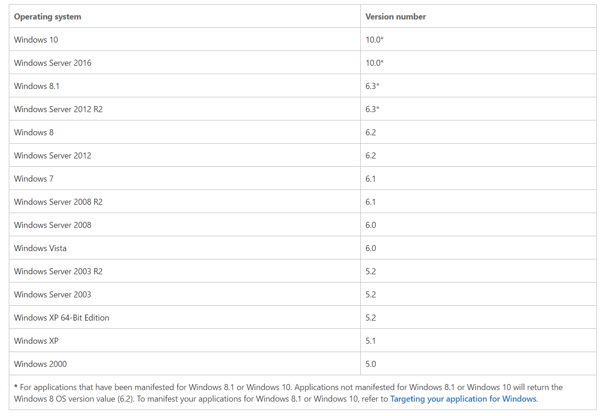

One of my friends was recently trying to run [Origin](https://www.origin.com/usa/en-us/) on her Windows 10 PC - it gave her a warning saying:

> PLEASE UPGRADE YOUR OPERATING SYSTEM FOR THE FULL ORIGIN EXPERIENCE

> Some features within Origin are no longer supported on your current Windows operating system (OS). To continue to chat with friends, view achievements, and shop and make purchases in Origin, please update your OS to Windows 7 or later.

> Note: You will still be able to download and play your games without updating your OS.

What?? I thought we were on Windows 10... This is obviously very frustrating to a user running - the onus is on developers to not mess that sort of thing up. In reality, version checks gone wrong are prevalent from drivers all the way up to user-mode applications like Origin. All of you reading this need to pinky swear that you're not going to mess it up in the future... right guys? Let's talk about how.

# How can I tell if my Windows code will run correctly on the user's current environment?

I don't know for sure what Origin is doing wrong to make this message show up, but I can speculate that they took several wrong turns that landed them in this mess. Here's what they should have done instead. 

## Check for the feature you need instead of checking the version
Think long and hard about the problem you're trying to solve - do you want to know if the user's PC has a certain functionality? Or do you actually care which OS version it's running? There are cases for both, but if you just want to know if your function is there, you can check for that. Microsoft has a [great guide here on how to do that](https://msdn.microsoft.com/en-us/library/windows/desktop/ms724832(v=vs.85).aspx).

## If you really need to do an OS check, use the Version Helper functions
There is this fabulous function that they can use called [IsWindows7OrGreater()](https://msdn.microsoft.com/en-us/library/windows/desktop/dn424972(v=vs.85).aspx). It does exactly what you think. There are a whole suite of these Version Helper functions for every Windows OS version - you can have an OS version checking bonanza with these babies!

## If all else fails, do it yourself. Carefully.
There are scenarios where you might need to do your own version check because you can't use the built in Version Helper functions. For example, maybe you're checking for the version of some other program rather than Windows. Doing your own version check requires careful consideration and no shortcuts. Read on...

# Hypothesis: Where Origin went wrong
Unfortunately, Origin did not do any of these things - they skipped straight to the "do it yourself" step and missed the part about "no shortcuts". 

Disclaimer: This is my own hypothesis, but it's pretty feasible. If Origin didn't mess up in this particular way I'm about to describe, someone else definitely has. 

First, let's get some background. What, you thought I'd just tell you the answer?

## Windows Versions
I'm going to let you in on a secret: Windows 7, 8, etc. are names made up by the marketing folks. If you thought that Windows 7 would be 7.0, you are WRONG. We engineers have our own numbers that we have for Windows, detailed in the table below.

#### If you're skimming, this table is the important part
If you thought the jump from Windows 8 to Windows 10 was crazy, just wait until you see what happened to the Windows version! We skipped straight from 6 to 10. 
*Why was 6 afraid of 7? Because 7 ate (8) 9. Hahaha. What a great joke... when I was six years old. Anyway.*

This table was up to date at the time of writing - Microsoft pays people to keep their docs updated, though, so you can find the most up-to-date one [here](https://msdn.microsoft.com/en-us/library/windows/desktop/ms724832(v=vs.85).aspx).

### Recent Windows Versions



## Laziness begets bugginess
Windows Vista was finished in 2006. Windows 10 came out in 2015. In between that is nine years of the major version being "6". To some developers, it must have felt like the major version would be "6" forever and they planned accordingly. This certainly manifested in some Very Bad Shortcuts.

## Poor Man's Version Check
Imagine that you are in charge of checking if your program will run on a given user's PC. Rather than following all of the great advice up there or taking the time to Google the right way to do it, you decide you have a fantastic idea.

Your program runs on Windows 7 and up, aka, version 6.1 and up. You decide to try the following check

```
	if (Version.major == 6 && Version.minor >= 1)
	{
		
		LaunchProgram();

		// Or whatever.

	}

	else
	{

	     ShowMessage("Codeinator 20000 requires Windows 7 or higher.");

	}
 ```

This is Very Broken the second that Microsoft revs `Version.major` to something other than "6", which is EXACTLY WHAT THEY DID for Windows 10. 

You now spend your days hiding from your boss.

## Assumptions that an external factor will never change are dangerous
In this example, developers got in a heap of trouble because they made a faulty assumption. They took a dependency on an external force that was subject (and likely) to change - they lost their bet in the long run.

It reminds me of all of those disclaimers that stock brokers have:

> Past performance is not an indicator of future results.