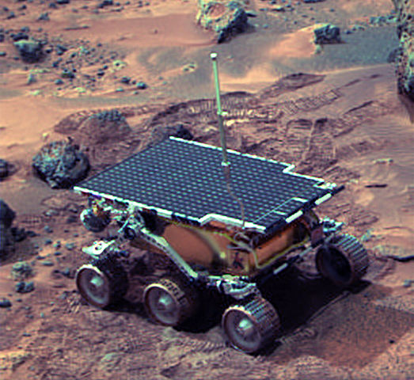

I recently read and extremely enjoyed _The Martian_ by Andy Weir, so I thought a little _The Martian_ themed post is in order. Don’t worry if you haven’t read the book (or seen the movie) – this post doesn’t require any knowledge of the book (you should still read it, though. It's that good.) or even of priority inversions. There are also no spoilers about The Martian beyond what you could get from reading the back cover, so read on.

!

In the book, some NASA scientists are trying to solve a big problem with their fictional Mars mission. To do so, they investigate a previous, real-life mission: Pathfinder, the Mars expedition that took place in 1997. Sojourner was the name of the rover on Mars. The character muses:

> “We’ve been looking through the old Pathfinder software. We got duplicate computers up and running for testing. Same computers they used to find a problem that almost killed the original mission. Real interesting story actually; turns out there was a priority inversion in Sojourner’s thread management and – “ 

He’s interrupted by a different character who wants him to focus on things that aren’t priority inversions. You’re in luck, though, since I do want to focus on priority inversions! I think my jaw dropped in excitement when I read this line regarding my favorite story about multithreading pitfalls in a New York Times bestseller. 

---

### What is a priority inversion?

Not all threads are created equal. Some threads are more important than others, and hence are assigned a higher priority. A thread scheduler will do its best to schedule higher priority threads first. (If the concept of threading is new to you, you can think of a thread as a task that runs on a computer processor).

In general, a high priority task will interrupt a lower priority task, complete, and then the lower priority task is able to complete.

A *priority inversion* occurs when there is a high priority task and a lower priority task - the high priority task cannot run until the lower priority task is done. 
That is, their relative priorities are inadvertantly inverted.

How can this be? The answer takes us back to Mars.

### Pathfinder's system reset

In July 1997, the world applauded as the first Mars mission to successfully use rovers, Pathfinder, landed on the red planet.

!

The excitement was short-lived for NASA engineers, though, because Pathfinder started experiencing system resets and losing data. Uh oh. In case it’s not obvious, your Martian lander should definitely not be continually resetting itself when it’s showtime. 

In what I consider to be one of the great feats of debugging in our time, engineers at the Jet Propulsion Lab (JPL) spent hours and hours under pressure racing against the clock as they tried to reproduce the failure on a replica Pathfinder in their lab. (remember, they’re trying to fix something that’s quite literally out of this world). When they finally saw a system reset on their replica Pathfinder, they looked at the events that occurred and eventually determined the root cause.

### Diagnosis: Priority inversion

Pathfinder has three threads that run at three different priorities. A thread scheduled at a higher priority interrupts a thread running at a lower priority. Each of the threads shared a single memory area, called the *information bus*. Only one thread can access the information bus at a time– if another thread wants to read from or write to the bus, it has to wait for the resource to become available. This prevents a thread’s information from being overwritten by another thread. (Concurrency-savvy readers: the information bus is protected with mutexes). 

Introducing our three thread contestants: 

1.	__Low priority__: Meteorological data gathering. This thread runs infrequently and publishes its data to the information bus so that it can get sent back to Earth. While it is publishing the data, it acquires exclusive access to the bus until it is done.
2.	__Medium priority__: Communications task. Doesn’t need the information bus, but it takes a long time to finish running. Pathfinder takes longer than ET to phone home.
3.	__High priority__: Bus management. This task takes the data that other threads have published to the information bus and sends it off to the right places in the operating system. It acquires exclusive access to the bus while it is reading/writing information here until it is done. This thread is critical to the correct operation of Pathfinder – if it doesn’t run for a while, the spacecraft assumes there is a fatal error and will initiate a system reset. 

Given those clues, you can probably guess that the reset is initiated from Pathfinder getting into a state where the high priority thread hasn’t run recently enough and the system watchdog initiates a reset. Keen readers probably suspect that there is foul play involving access to the information bus.

Consider the following scenario which led to the eventual priority inversion and system reset:

-	Low priority meteorological data thread opens the bus for exclusive access to publish its data.
-	High priority management thread wants to run, but it cannot run while the low priority thread has exclusive access to the bus – it needs to wait until the low priority thread releases the bus before it can be scheduled. (note: this wait is an incredibly short period of time, which is why this priority inversion scenario is rare)
-	While the high priority thread is waiting, the medium priority communications thread is scheduled. This interrupts the low priority thread and runs for a long time.
-	Wait a minute, the high priority thread is still waiting on the low priority thread to be done with the bus! Wait another minute, the low priority thread can’t run until the medium priority thread is done! Uh oh!
-	While the medium priority thread is taking its sweet time to finish, the system watchdog gets tired of waiting for the high priority task to run and initiates a system reset. This does not necessarily occur every time since the medium priority thread could feasibly finish before the watchdog timeout. When it does occur, it’s bad news for Pathfinder.

### Why didn’t they catch this on Earth?

NASA has longer statements that you can read about why exactly they didn’t catch this bug during development, but a major contributing factor is that the spacecraft was sending much more data while on Mars than in a lab. The stressful conditions allowed this faulty code path to be hit more frequently. 

### How did they fix it?

There are several different ways to fix a priority inversion. The JPL engineers chose *priority inheritance*. That means that any task (in this case, the low priority meteorological task) inherits the priority of a higher priority task that is waiting on a resource (information bus) it is holding. When it releases the resource, it assumes its original priority.

---

### Concurrency is cool and relevant to pop culture after all!

I love this story – a real-life, high-stakes space mission almost bungled by a priority inversion, saved by engineers and computer theorists alike during long caffeine-fueled hours. Maybe it’s not as good as Mark Watney’s journey across Mars, but concurrent programming deserves to be the star of its own story once in a while.

---

##### Links for further reading

- [Microsoft's informal debriefing about the priority inversion](http://research.microsoft.com/en-us/um/people/mbj/Mars_Pathfinder/Mars_Pathfinder.html)
- [Mars Pathfinder mission page](http://www.nasa.gov/mission_pages/mars-pathfinder/)
- [Amazon link to The Martian book](http://www.amazon.com/gp/product/B00EMXBDMA/ref=dp-kindle-redirect?ie=UTF8&btkr=1])
- [Wikipedia: Priority inversion](https://en.wikipedia.org/wiki/Priority_inversion)
- [Wikipedia: Priority inheritance](https://en.wikipedia.org/wiki/Priority_inheritance)

