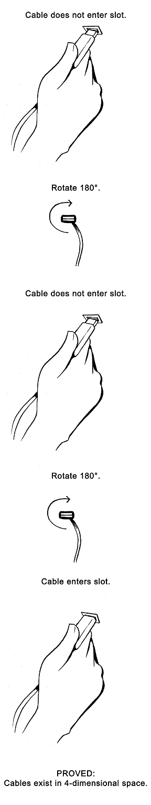
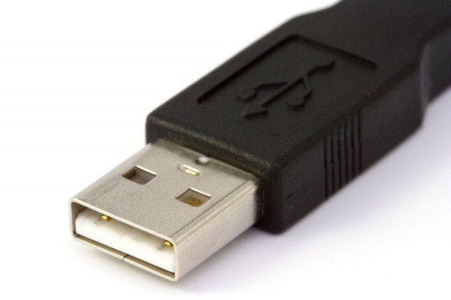
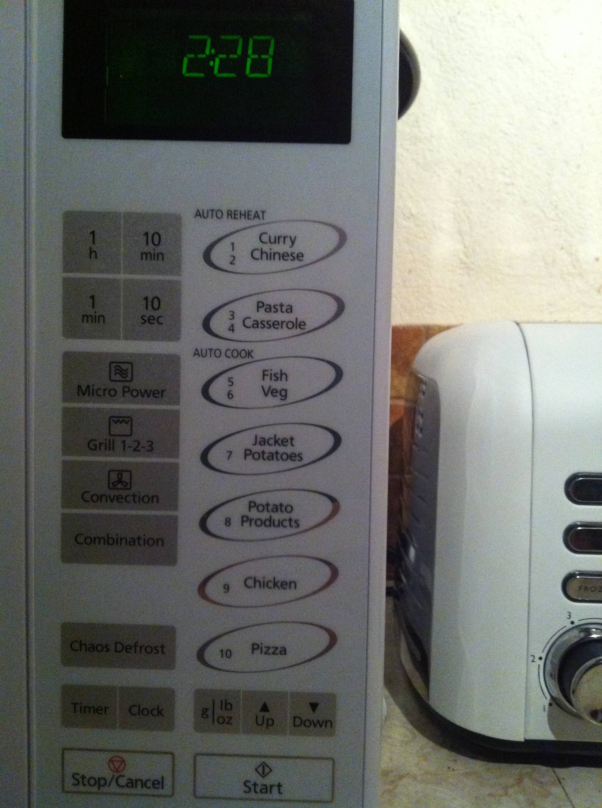
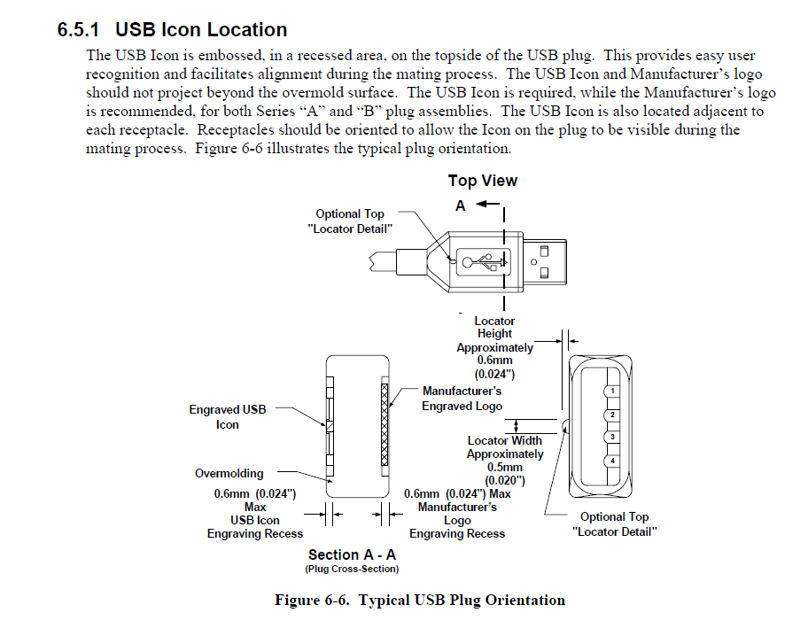

When I tell people that I work on USB at my job, a startlingly high number of you say something like *"Can you do something about the problem where it takes 3 tries to plug the darn thing in? HAhahahaahahHAAA!!"*. 

Yep, you guys sure are hilarious. I also have this problem - I used to resort to wildly jamming the plug around until something clicks (...still my approach for most types of cables, who am I kidding) until I learned the right way to do it. 

The [Saturday Morning Breakfast Cereal comic](http://www.smbc-comics.com/?id=2388) proposes a quantum physical explanation for this frustrating behavior:

Turns out that plugging it in correctly isn't voodoo magic, though - there's actually a way to figure out which way is up or down on a USB Type-A or Type-B (or any of its mini/micro variants) plug:

### Trick: The USB logo always goes on top.

Look for the USB trident logo, rotate the connector plug so that the logo is facing upwards, and voila. Connected on the first try.

This doesn't work in cases where your USB receptacle is installed upside down (I've been on planes boasting in-seat charging and realized that the ports were actually upside down. Oops. Back to wildly jamming the plug in.) or if your cable is **gasp** not certified. 

In order to use that little trident logo, devices and cables need to pass a series of tests provided by the USB Implementers Forum (USB-IF). The USB-IF is the industry standards body made up of many different companies that create USB products. Once a device is certified, it may use the USB logo.

### Why does this trick work reliably?

I knew that the "logo always on top" trick worked, but why? Manufacturers rarely all follow the same convention on their own. 

Have you ever tried using a microwave at someone else's house before? Why can't we agree what the right sequence of keys is to cook food for 30 seconds? Why do some microwaves require extra button presses? Why do some microwaves have alarmingly specific presets?

What the...!? How do I even use this thing?! Why are there two separate potato options?
Remind me to propose a microwave oven industry standards body so that "Curry Chinese" is never, EVER allowed on a microwave oven button panel ever again. Please.

My point is that this is obviously a microwave and it looks similar to the microwave I have in my apartment, but the way you heat something for 30 seconds on my microwave is a little different than however you'd go about it on this one.

Why would hardware be any different? Why aren't there USB logos in all sorts of weird nooks and crannies in "Pasta Casserole" themes?

### Look at the spec!

Why is the logo on top? Because the USB-IF says so. There are long and detailed specifications (which are open to anyone - you can read them at the [USB-IF website](http://usb.org/developers)) that lay out exactly how USB works.

I went and found the section in the spec that mandates the position of the logo so you don't have to! 
It's in the USB 2.0 specification in chapter 6. 

Logo on top. QED. The Microwave Oven Federation should take notes for their button panels... if only we had one of those. The hero we need, but not the one we deserve.