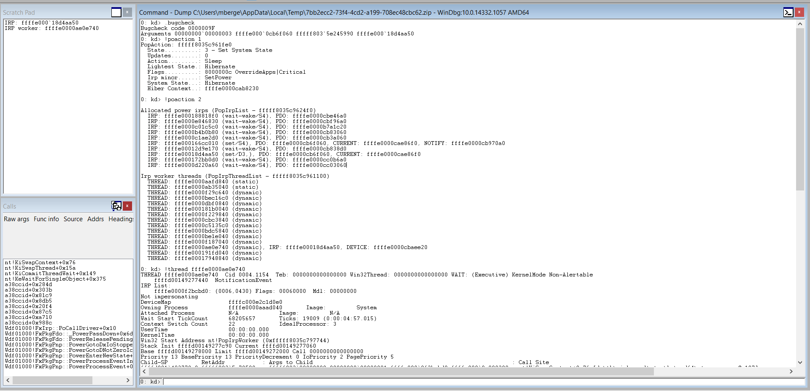

This post is for driver or kernel developers/enthusiasts who have encountered a Blue Screen of Death on Windows where the [bugcheck code is 0x9F](https://msdn.microsoft.com/en-us/library/windows/hardware/ff559329(v=vs.85).aspx), DRIVER_POWER_STATE_FAILURE, and parameter 1 is 0x3. There are a few variants on DRIVER_POWER_STATE_FAILURE, but this one is when a device object has been blocking an IRP for too long a time.

If you're not familiar with IRPs, you should probably back up and learn the basics. Check out [Power IRPs for individual devices](https://msdn.microsoft.com/en-us/library/windows/hardware/ff559804(v=vs.85).aspx). I'm not going to explain them here, but when a device connected to the system is making a power transition, it is responsible for completing that power transition within 2 minutes. 

So, if your computer is trying to go to sleep and you have a webcam connected to it that should go to sleep along with the system, the driver for that webcam needs to complete the power IRP within two minutes. If it doesn't, a watchdog timer fires and the system bugchecks with code 9F, parameter 3. Two minutes should be ample time for any device to complete a power IRP; if it takes more than that, it usually means there is a deadlock somewhere in the system.

### You will need:

#### 1. A kernel or full dump
9Fs are different than other crashes in that it's not a single faulting line of source code. A wonderful debugging mentor of mine describes solving 9Fs as "untangling a chain of dependencies". You need a full view of the system in order to confidently make a diagnosis here, in most cases. A minidump often won't provide enough information.

#### 2. WinDBG or KD set up to debug a crash dump
I know that my readers have a wide range of technical skills - if you don't know how to use at least the basics WinDBG or KD to kernel debug, you may want to start there. See [Getting Started with Windows Debugging](https://msdn.microsoft.com/en-us/library/windows/hardware/mt219729(v=vs.85).aspx).
Once you have WinDBG set up and your crash dump opened, be sure you have somewhere to take notes. Personally, I'm crazy about WinDBG's Scratch Pad functionality. Here's a tiny picture of the WinDBG workspace I use for crash dumps ([bigger picture here](http://i.imgur.com/neYsvgu.png)) - see how I have my notes right there in the same window on the top left. You'll have to figure out whatever works for you if you haven't already, though.



### Basic steps to solve a 9F 3
9Fs range from extremely easy problems that you can solve in 2 minutes to extremely difficult that several experienced engineers will scratch their heads at for days. We're going to stick with an easier one. The steps I describe here are the foundation of solving any 9F 3.

#### 1. Start with .bugcheck to find out the stuck power IRP
We need to know which power IRP is stuck. This will be in bugcheck parameter 4.

```
0: kd> .bugcheck
Bugcheck code 0000009F
Arguments 00000000`00000003 ffffe000`0cb6f060 fffff803`5e245990 ffffe000`18d4aa50
```

Cool, our power IRP is `ffffe00018d4aa50`. Write this down in your notes so you can easily copy/paste it later.

#### 2. Look at IRPs and IRP worker threads with !irp and !poaction 2
First, we want to check out the IRP worker threads that are in the 2nd section of `!poaction`. `!poaction` is useful for any crash involving a power transition, such as bugcheck 0x9F 3. You can experiment with looking at the full output of the command on your own.

We want to see if our IRP is being serviced by one of the IRP worker threads. 

```
0: kd> !poaction 2

Allocated power irps (PopIrpList - fffff8035c9624f0)
  IRP: ffffe000188818f0 (wait-wake/S4), PDO: ffffe0000cbe46a0
  IRP: ffffe0000e846830 (wait-wake/S4), PDO: ffffe0000cbf96a0
  IRP: ffffe0000c01c5c0 (wait-wake/S4), PDO: ffffe0000b7a1c20
  IRP: ffffe0000b4b0b80 (wait-wake/S4), PDO: ffffe0000cb83060
  IRP: ffffe0000c1ae2d0 (wait-wake/S4), PDO: ffffe0000cb3a060
  IRP: ffffe000166cc010 (set/S4), PDO: ffffe0000cb6f060, CURRENT: ffffe0000cae86f0, NOTIFY: ffffe0000cb970a0
  IRP: ffffe00012d9e170 (wait-wake/S4), PDO: ffffe0000cb838d0
  IRP: ffffe00018d4aa50 (set/D3,), PDO: ffffe0000cb6f060, CURRENT: ffffe0000cae86f0
  IRP: ffffe000172bb0d0 (wait-wake/S4), PDO: ffffe0000cc0b6a0
  IRP: ffffe0000d220a60 (wait-wake/S4), PDO: ffffe0000cc03060

Irp worker threads (PopIrpThreadList - fffff8035c961100)
  THREAD: ffffe0000aafd840 (static)
  THREAD: ffffe0000ab35040 (static)
  THREAD: ffffe0000f29c640 (dynamic)
  THREAD: ffffe0000bec16c0 (dynamic)
  THREAD: ffffe0000dbf0840 (dynamic)
  THREAD: ffffe000181b0040 (dynamic)
  THREAD: ffffe0000f229840 (dynamic)
  THREAD: ffffe0000cbc3840 (dynamic)
  THREAD: ffffe0000c5135c0 (dynamic)
  THREAD: ffffe0000bdc5840 (dynamic)
  THREAD: ffffe0000be1e040 (dynamic)
  THREAD: ffffe0000f187040 (dynamic)
  THREAD: ffffe0000ae0e740 (dynamic), IRP: ffffe00018d4aa50, DEVICE: ffffe0000cbaee20
  THREAD: ffffe000191fd040 (dynamic)
  THREAD: ffffe00017948840 (dynamic)
```

Look at that! We see our IRP is a Set/D3 IRP and that it's being serviced by that worker thread `ffffe0000ae0e740`. Write that thread down.

If our stuck IRP isn't here, don't despair - see what's going on in IRP worker threads using the techniques below that are running to see if you can get a better picture of what's going on in the system. At this point, you can look at the IRP itself with `!irp` to get some ideas about where it's stuck.

Output truncated to the interesting bits for brevity:

```
0: kd> !irp ffffe000`18d4aa50
Irp is active with 11 stacks 9 is current (= 0xffffe00018d4ad60)
 No Mdl: No System Buffer: Thread 00000000:  Irp stack trace.  
     cmd  flg cl Device   File     Completion-Context

>[IRP_MJ_POWER(16), IRP_MN_SET_POWER(2)]
            0  1 ffffe0000cae86f0 00000000 00000000-00000000    pending
	       \Driver\A38CCID
			Args: 00015600 00000001 00000004 00000003

```

Hmm, it's pending in some driver called A38CCID. Seems suspicious. We'll get back to that.

#### 3. Look at the IRP worker thread with !thread or .thread
We saw our stuck IRP is being serviced in that IRP worker thread. Let's check it out! 
You can see detailed information about the thread with `!thread ffffe0000ae0e740` or you can switch to the thread context with `.thread ffffe0000ae0e740`. For space/readability, I'll do the latter. 

```
0: kd> .thread ffffe0000ae0e740
Implicit thread is now ffffe000`0ae0e740
0: kd> kc
  *** Stack trace for last set context - .thread/.cxr resets it
 # Call Site
00 nt!KiSwapContext
01 nt!KiSwapThread
02 nt!KiCommitThreadWait
03 nt!KeWaitForSingleObject
04 a38ccid
05 a38ccid
06 a38ccid
07 a38ccid
08 a38ccid
09 a38ccid
0a a38ccid
0b a38ccid
0c Wdf01000!FxIrp::PoCallDriver
0d Wdf01000!FxPkgFdo::_PowerPassDown
0e Wdf01000!FxPkgFdo::PowerReleasePendingDeviceIrp
0f Wdf01000!FxPkgPnp::PowerGotoDxIoStopped
10 Wdf01000!FxPkgPnp::PowerGotoDNotZeroIoStopped
11 Wdf01000!FxPkgPnp::PowerEnterNewState
12 Wdf01000!FxPkgPnp::PowerProcessEventInner
13 Wdf01000!FxPkgPnp::PowerProcessEvent
14 Wdf01000!FxPkgFdo::LowerDevicePower
15 Wdf01000!FxPkgFdo::DispatchDeviceSetPower
16 Wdf01000!FxPkgPnp::Dispatch
17 Wdf01000!DispatchWorker
18 Wdf01000!FxDevice::Dispatch
19 Wdf01000!FxDevice::DispatchWithLock
1a nt!PopIrpWorker
1b nt!PspSystemThreadStartup
1c nt!KxStartSystemThread
```

You can see immediately what's happening here. WDF is passing down a power IRP to our device, whose driver is a38ccid.sys. It never completes the power IRP, so the machine falls over when its two minutes are up. We don't have the symbols for that driver since it's not part of Windows, but we can look at it anyway:

```
0: kd> !lmi a38ccid
Loaded Module Info: [a38ccid] 
         Module: a38ccid
   Base Address: fffff800210c0000
     Image Name: a38ccid.sys
   Machine Type: 34404 (X64)
     Time Stamp: 55691a7e Fri May 29 19:03:42 2015
           Size: f800
       CheckSum: 18772
Characteristics: 22  
Debug Data Dirs: Type  Size     VA  Pointer
             CODEVIEW    77,  cf38,    cf38 RSDS - GUID: {FA73C7E5-9828-482F-BDDB-9A0F69E150C2}
               Age: 1, Pdb: c:\winddk\7600.16385.1\unified_driver-src\acsccid\latest\objfre_win7_amd64\amd64\acsdrvx64.pdb
     Image Type: MEMORY   - Image read successfully from loaded memory.
    Symbol Type: NONE     - PDB not found from image header.
    Load Report: no symbols loaded
```

If you own the driver that shows up here, you can take some extra steps to see what your driver is doing wrong that's causing it to hold that power IRP for 2 minutes before completing it. If you don't, there's not much you can do to solve it, but you at least know who the culprit is. You can look up the name of the faulting driver online is and report a bug to their engineering team. In this case, a38ccid.sys is a smart card reader driver.

#### 4. Other things to try: !stacks 2
Once you suspect a driver is at fault, you should see which thread stacks it shows up in. Sometimes you'll see smoking guns. For example, maybe your driver that you identified in step 3 is calling `WdfSpinlockAcquire` in another thread, which may indicate that they have a textbook deadlock somewhere.

Try it out on your own dump! Output truncated to the interesting parts.

```
0: kd> !stacks 2 a38ccid
4.000d14  ffffe0000ba79040 fc006b27 Blocked    nt!KiSwapContext+0x76
                                        nt!KiSwapThread+0x15a
                                        nt!KiCommitThreadWait+0x149
                                        nt!KeWaitForMultipleObjects+0x24e
                                        a38ccid+0x159e
                                        nt!PspSystemThreadStartup+0x41
                                        nt!KxStartSystemThread+0x16
   4.001154  ffffe0000ae0e740 fbef43a7 Blocked    nt!KiSwapContext+0x76
                                        nt!KiSwapThread+0x15a
                                        nt!KiCommitThreadWait+0x149
                                        nt!KeWaitForSingleObject+0x375
                                        a38ccid+0x284d
                                        a38ccid+0x303b
                                        a38ccid+0x81c9
                                        a38ccid+0x8db5
                                        a38ccid+0x20f4
                                        a38ccid+0x87c5
                                        a38ccid+0xa710
                                        a38ccid+0x988c
                                        Wdf01000!FxPkgFdo::_PowerPassDown+0x6d
                                        Wdf01000!FxPkgFdo::_PowerPassDown+0x6d
                                        Wdf01000!FxPkgFdo::PowerReleasePendingDeviceIrp+0x44
                                        Wdf01000!FxPkgPnp::PowerGotoDxIoStopped+0x180
                                        Wdf01000!FxPkgPnp::PowerGotoDNotZeroIoStopped+0x9
                                        Wdf01000!FxPkgPnp::PowerProcessEventInner+0x234
                                        Wdf01000!FxPkgPnp::PowerProcessEventInner+0x234
                                        Wdf01000!FxPkgPnp::PowerProcessEvent+0x25f
                                        Wdf01000!FxPkgFdo::DispatchDeviceSetPower+0x65
                                        Wdf01000!FxPkgFdo::DispatchDeviceSetPower+0x65
                                        Wdf01000!FxPkgPnp::Dispatch+0xb2
                                        Wdf01000!FxDevice::DispatchWithLock+0x111
                                        Wdf01000!FxDevice::DispatchWithLock+0x111
                                        Wdf01000!FxDevice::DispatchWithLock+0x111
                                        nt!PopIrpWorker+0x1f6
                                        nt!PspSystemThreadStartup+0x41
                                        nt!KxStartSystemThread+0x16

```

Our faulty driver is in two different stacks right now and each of them is waiting on something. There's a `KeWaitForMultipleObjects` in the first stack and a `KeWaitForSingleObject` in the second stack, which we recognize to also be the IRP worker thread. It's impossible to tell for sure without the symbols, but it looks like they have a bug in their synchronization. These threads might waiting on each other, which would be a deadlock. If not, they're waiting on something else that is never happening. Either way, we can say with a high degree of confidence that a83ccid.sys is the culprit here.

#### 5. Other things to try: !running -it
Sometimes your stuck IRP is the victim of activity on some other processor. You can view what's running on all processors to see if anything looks suspicious. Use `!running -it`.

Note: This particular case isn't a good candidate for `!running -it`, so I've omitted the output. I'd like to give a different example that makes use of `!running -it` in a different post.

#### Solving the puzzle
If you follow those steps, you will often be able to tell if your system exhibits the symptoms of a 3rd party (non-Windows) device driver blocking the power IRP from being completed. There are a multitude of other causes for DRIVER_POWER_STATE_FAILURE with a stuck IRP, but a faulty 3rd party driver is among the most common ones.

To me, there are few things more satisfying than solving a nice bugcheck 0x9F 3. I speculate that it's weird to have a favorite BSOD crash to debug, but I find it very methodical and engaging with a fascinating view into the system, to boot. I'm a sucker for puzzles, though. [Shoot me an email](mailto:mrbit@outlook.com) if you have any for me.

Happy debugging!