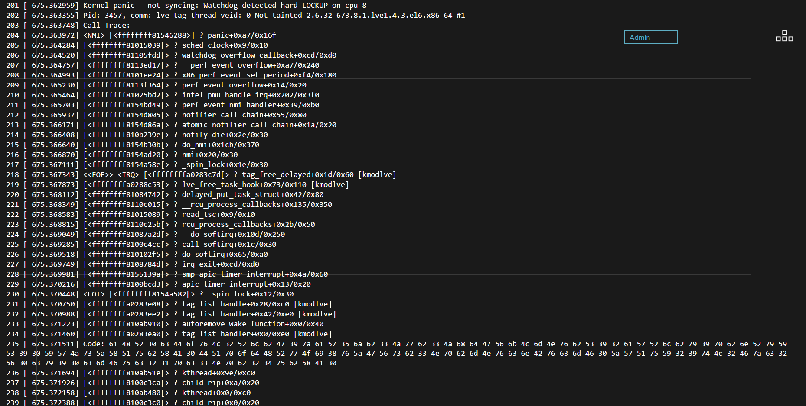

I've had a lot of free time the past week and a half because I had hip surgery last Wednesday. During my time on the couch, I watched the entirety of HBO's highly-addictive sci-fi/Western series, [Westworld](http://www.hbo.com/westworld). Here are some silly observations about the future of tech if the future is the one imagined in the show.

The show takes place sometime in the future - the premise as described by Wikipedia: "The story takes place in the fictional Westworld, a technologically advanced Wild West–themed amusement park populated by android hosts. Westworld caters to high-paying guests, who may indulge in whatever they wish within the park, without fear of retaliation from the hosts."

### Computing power

These guys are two of the androids in the park. They look and act real, which obviously requires a lot of computing power!


For perspective, [Google's DeepMind AI used 1202 CPUs and 176 GPUs to beat the world champion of the Chinese board game Go](http://www.businessinsider.com/heres-how-much-computing-power-google-deepmind-needed-to-beat-lee-sedol-2016-3). 

Presumably, the future of Westworld is having luck with Moore's Law in order to have hundreds of realistic androids packed with that much computing power. For some reason, they have an AI and hardware in each individual host rather than powering the AI in "the cloud" - that sounds super expensive! If they bring a host offline, they can't use those computing resources for anything! But hey, the major plot points of the show would be totally ruined if they could do it in the cloud.

### Processors and OS versions

HBO set up a [website for Delos Incorporated](http://delosincorporated.com/), which is the corporate owner of the Westworld theme park in the show. It's more of a fun little Easter egg for viewers than anything else. They'd update it with relevant information to match the plot as more episodes came out. 

*-very mild spoilers, but nothing more than you can gain by just visiting delosincorporated.com on your own-*

Delos Incorporated is currently experiencing some technical malfunctions as of the end of Season 1. Their website reflects this (screenshot taken 3/31/2017 - I assume it will change when Season 2 comes out).



Wow, there are a lot of fun things we can learn about Delos Incorporated and the "future" here from the stack trace that's printed on the screen!

- Delos Incorporated is using Red Hat.
- They're using an old kernel, especially because this is the future! 2.6.32 reached End of Life in February 2016. Hopefully Red Hat is keeping that up to date for them.
- They're using 64 bit Intel CPUs! awesome.
- Less awesome: They seriously need either a BIOS update or to replace CPU 8. "hard LOCKUP" means that the CPU hasn't responded to an interrupt within the alloted time. Come on, guys.

In case you can't view the image or it's too small on your screen, here is the stack trace:
```
201 [ 675.362959] Kernel panic - not syncing: Watchdog detected hard LOCKUP on cpu 8
202 [ 675.363355] Pid: 3457, comm: lve_tag_thread veid: 0 Not tainted 2.6.32-673.8.1.lve1.4.3.el6.x86_64 #1
203 [ 675.363748] Call Trace:
204 [ 675.363972] <NMI> [<ffffffff81546288>] ? panic+0xa7/0x16f
205 [ 675.364284] [<ffffffff81015039[> ? sched_clock+0x9/0x10
206 [ 675.364520] [<ffffffff81105fdd[> ? watchdog_overflow_callback+0xcd/0xd0
207 [ 675.364757] [<ffffffff8113ed17[> ? __perf_event_overflow+0xa7/0x240
208 [ 675.364993] [<ffffffff8101ee24[> ? x86_perf_event_set_period+0xf4/0x180
209 [ 675.365230] [<ffffffff8113f364[> ? perf_event_overflow+0x14/0x20
210 [ 675.365464] [<ffffffff81025bd2[> ? intel_pmu_handle_irq+0x202/0x3f0
211 [ 675.365703] [<ffffffff8154bd49[> ? perf_event_nmi_handler+0x39/0xb0
212 [ 675.365937] [<ffffffff8154d805[> ? notifier_call_chain+0x55/0x80
213 [ 675.366171] [<ffffffff8154d86a[> ? atomic_notifier_call_chain+0x1a/0x20
214 [ 675.366408] [<ffffffff810b239e[> ? notify_die+0x2e/0x30
215 [ 675.366640] [<ffffffff8154b30b[> ? do_nmi+0x1cb/0x370
216 [ 675.366870] [<ffffffff8154ad20[> ? nmi+0x20/0x30
217 [ 675.367111] [<ffffffff8154a58e[> ? _spin_lock+0x1e/0x30
218 [ 675.367343] <<EOE>> <IRQ> [<ffffffffa0283c7d[> ? tag_free_delayed+0x1d/0x60 [kmodlve]
219 [ 675.367873] [<ffffffffa0288c53[> ? lve_free_task_hook+0x73/0x110 [kmodlve]
220 [ 675.368112] [<ffffffff81084742[> ? delayed_put_task_struct+0x42/0x80
221 [ 675.368349] [<ffffffff8110c015[> ? __rcu_process_callbacks+0x135/0x350
222 [ 675.368583] [<ffffffff81015089[> ? read_tsc+0x9/0x10
223 [ 675.368815] [<ffffffff8110c25b[> ? rcu_process_callbacks+0x2b/0x50
224 [ 675.369049] [<ffffffff81087a2d[> ? __do_softirq+0x10d/0x250
225 [ 675.369285] [<ffffffff8100c4cc[> ? call_softirq+0x1c/0x30
226 [ 675.369518] [<ffffffff810102f5[> ? do_softirq+0x65/0xa0
227 [ 675.369749] [<ffffffff8108784d[> ? irq_exit+0xcd/0xd0
228 [ 675.369981] [<ffffffff8155139a[> ? smp_apic_timer_interrupt+0x4a/0x60
229 [ 675.370216] [<ffffffff8100bcd3[> ? apic_timer_interrupt+0x13/0x20
230 [ 675.370448] <EOI> [<ffffffff8154a582[> ? _spin_lock+0x12/0x30
231 [ 675.370750] [<ffffffffa0283e08[> ? tag_list_handle+0x28/0xc0 [kmodlve]
232 [ 675.370988] [<ffffffffa0283ee2[> ? tag_list_handler+0x42/0xe0 [kmodlve]
233 [ 675.371223] [<ffffffff810ab910[> ? autoremove_wake_function+0x0/0x40
234 [ 675.371460] [<ffffffffa0283ea0[> ? tag_list_handler+0x0/0xe0 [kmodlve]
235 [ 675.371511] Code: 61 48 52 30 63 44 6f 76 4c 32 52 6c 62 47 39 7a 61 57 35 6a 62 33 4a 77 62 33 4a 68 64 47 56 6b 4c 6d 4e 76 62 53 39 32 61 57 52 6c 62 79 39 70 62 6e 52 79 59 53 39 30 59 57 4a 73 5a 58 51 75 62 58 41 30 44 51 70 6f 64 48 52 77 4f 69 38 76 5a 47 56 73 62 33 4e 70 62 6d 4e 76 63 6e 42 76 63 6d 46 30 5a 57 51 75 59 32 39 74 4c 32 46 7a 63 32 56 30 63 79 39 30 63 6d 46 75 63 32 31 70 63 33 4e 70 62 32 34 75 62 58 41 30
236 [ 675.371694] [<ffffffff810ab51e[> ? kthread+0x9e/0xc0
237 [ 675.371926] [<ffffffff8100c3ca[> ? child_rip+0xa/0x20
238 [ 675.372158] [<ffffffff810ab480[> ? kthread+0x0/0xc0
239 [ 675.372388] [<ffffffff8100c3c0[> ? child_rip+0x0/0x20
```

What do you think?
