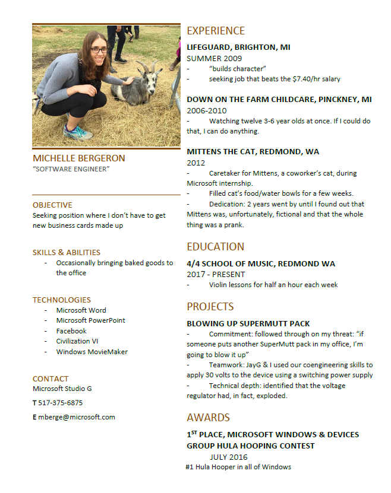

The past few months have been filled with several conscious efforts to change my life for the better.

Why?

In early 2017, I had a gradual realization: I was supremely unhappy at work.
The reasons are myriad and I don't care to delve too far into it, but one big one is that I was super burned out. I've lived with clinical depression for all of my adult life - it's generally under control, but this spring I reached a place where workplace stressors completely consumed me. There was a point where I was actually suicidal and my fiance stayed home all day with me to make sure I was okay (I saw a therapist as well, etc).

Spoiler alert: I'm okay.

At some point in the bottom of my well of unhappiness, I knew there was one good way out, but it was not easy. So:

### Step 1

*I quit my job.*

Well, sort of. My new job, which I began in June 2017, is not too different from my old job - I still work in USB (but also sensors now!), but instead of being a dev, I now have a Quality role. In my case, that means that I get to do more with tools and things like that, which was always the best part of my old job but now I get to focus on it! Secondly, I love the space (hardware! protocols! kernel mode! etc!), so I didn't have to say goodbye to my favorite things (or people). 
So far, I'm very happy with the new job and absolutely love it. I keep waiting for the honeymoon phase to wear off, but I'm not there yet.

That's a very glaze-over-the-details version; the reality is that the transition was not as smooth as I'm making it sound. A nonzero number of people tried talking me out of it and, at the time, I really questioned if it was the right choice. Hindsight being 20/20, my only regret is not doing it months sooner.

### Step 2
Let's back up - before starting my new job, I decided to take some time away from work since it was the big monster in my life making me so depressed. I took 2.5 weeks and went to Central Asia (Kyrgyzstan, Tajikistan, and Uzbekistan). This was a GREAT life choice - getting out there and exploring made me feel human again. Even when things weren't going well (food poisoning, eating yucky horsemeat, etc.), it was amazing to have a *different* set of problems in my life than the ones I'd been living with already!

### Step 3
The last big change was something I'd dreamed of literally since I was a little girl. In first (or second?) grade, my parents asked "what instrument do you want to play?". I knew the answer immediately - violin!

However... my ever-so-charming father decided that he didn't want to be listening to "cat screeching noises" the first few months while we were getting the hang of it. Despite the illusion of choice, I was informed that I had been signed up for piano lessons instead.
Fast forward to May 2017 - I remembered my violin dream and did some research about if it's possible to learn violin as an adult. The answer: of course it is. We even have advantages in some ways - we can focus better than kids! So, I bought a violin on Amazon and signed up for weekly lessons. I've got a long way to go, but I've made a lot of progress from "Twinkle Twinkle" - I've completed my beginner book and I'm even playing some simple pieces by Bach now! I'm taking weekly progress videos which are going to be a lot of fun to watch later on.

I am one bazillion times happier and more productive now than I was 6 months ago. The message I want to share is that if there is something within your control in your life that you want to change, do it.

### Resume

As your bonus for reading, here's the resume I submitted for my new job. Remember how I said that I'm still working in USB? Well, everyone on the team knew me and was familiar with my work, but per company policy/labor law, I still had to apply and do an interview. Here's what I came up with (and yes, I obviously got the job)

