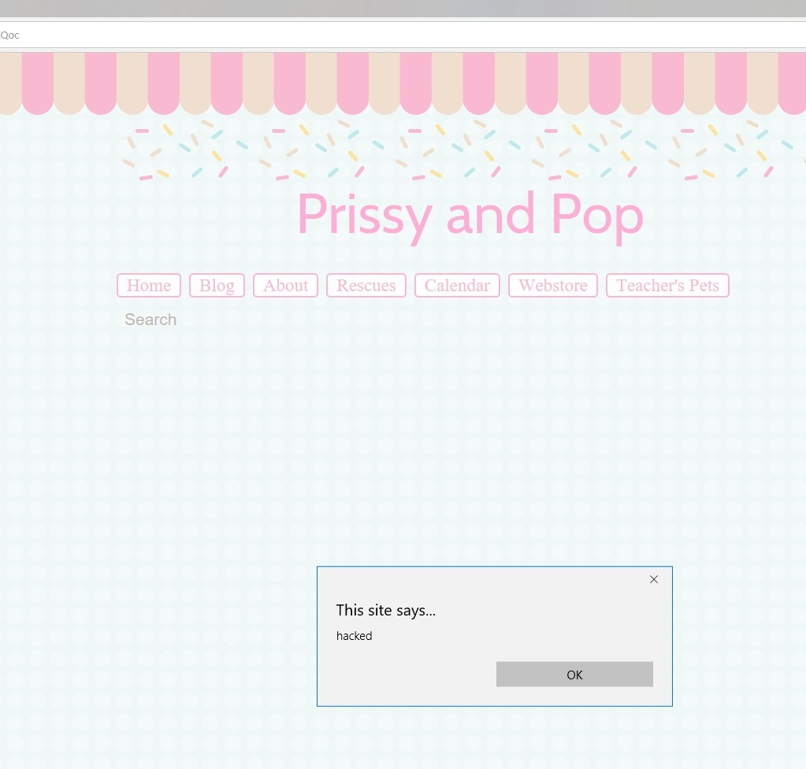

Recently, I participated in a couple of Capture the Flag (CTF) security events at Microsoft (my employer) for the first time.

Capture the Flag is a game for nerds where you have to exploit security vulnerabilities on a system or website (provided by the competition - it's not really stealing data) in order to find the hidden data (the "flag"). The way you win is to hack better than your fellow nerds to solve the most challenges in the allotted time.

Security is not where my background is (most of you who read this probably already know I'm more of a drivers girl), but I learned a lot about some web attack vectors and actually ended up doing pretty well at the CTF events.

The websites from Capture the Flag are insecure by design and are only accessible by people playing the game - I decided to make it my goal to find a vulnerability in real life with the new tricks I learned.

Spoiler alert: I found one and it's been patched!

# Cross-site scripting
One of the more common security flaws in websites is called [Cross-Site Scripting](https://en.wikipedia.org/wiki/Cross-site_scripting), commonly abbreviated as XSS (b/c everything is cooler with an X, plus CSS is already taken).

The layman's premise behind XSS is that you can inject (probably malicious) code into a third party's web page. When someone visits that page, the code will run and it might do something evil like stealing the data the user puts in to that page. Meanwhile, the owner of the website has no clue this is going on.

# Reflecting text from a URL
Imagine a webpage which has the URL `http://superhapppyfunexamplecode.com/user.php?errortext=User%20Not%20Found`. 
The webpage then takes the error text from the URL and prints it out onto the page (in this case, "User Not Found". The `%20` is just the way to encode a space in a URL).

You can then mess with this URL - for instance, I could visit the URL `http://superhapppyfunexamplecode.com/user.php?errortext=I%20Love%20Mini%20Pigs` and it would print out "I love mini pigs".

# What if you're actually an aspiring supervillain?
What if you don't want to print things about pigs? What if you were SUPER EVIL and you spend your days trying to figure out how to get people to run your SUPER EVIL code? Obviously, nobody wants to run something that's blatantly EVIL, so you have to trick them into running it. 

We know we can change the `errortext` query string to whatever we want, so why don't we put something more... EVIL... in there?

## Scripts
Webpages run their own scripts all the time to keep the web running smoothly. 
Here's an example of a script in HTML encoding:
``

This will pop up a box on the webpage which displays "hacked" to the user. Okay, it's not evil yet, but you're just an *aspiring* supervillain.

So, let's punch in `http://superhapppyfunexamplecode.com/user.php?errortext=` to our favorite browser *

Tada! The user now sees they've been hacked. Now to send our Evil URL to everyone we can find so we can "hack" them.

# Real life example
Speaking of mini pigs... I am vaguely embarrassed (but also not embarrassed at all) to admit that I follow a [Facebook page dedicated to a mini pig named Priscilla](https://www.facebook.com/PrissyandPop/). Mini pigs are freaking adorable, okay? They recently mentioned the [launch of their new website](http://www.prissyandpop.com/), so I of course clicked on it. I am easily tempted by adorable farm animals, but then again, who isn't?

My brain was still in Capture the Flag mode, so I decided I was going to find something more... exciting on the website. Sorry, piggies.

Sure enough, their (now-defunct) webstore page was doing exactly this "reflect text back from the URL" thing described above on their search function, so I put in a search for ``. Amusingly enough, it did make me click through an "I'm not a robot" CAPTCHA to perform the search, but did not try to filter out the script in the URL. 

The result:

# Coordinated disclosure
I reached out to the site owner after googling around for some email templates for disclosure (like I said, I'm new to this!) and provided them with the [OWASP XSS Prevention Cheat Sheet](https://www.owasp.org/index.php/XSS_(Cross_Site_Scripting)_Prevention_Cheat_Sheet). To mitigate it, they've now removed the offending webstore page entirely (they weren't selling anything there, anyway).

* note: [Chrome has an XSS auditor](https://www.chromium.org/developers/design-documents/xss-auditor) which will try to catch aspiring supervillains trying stuff like this.
